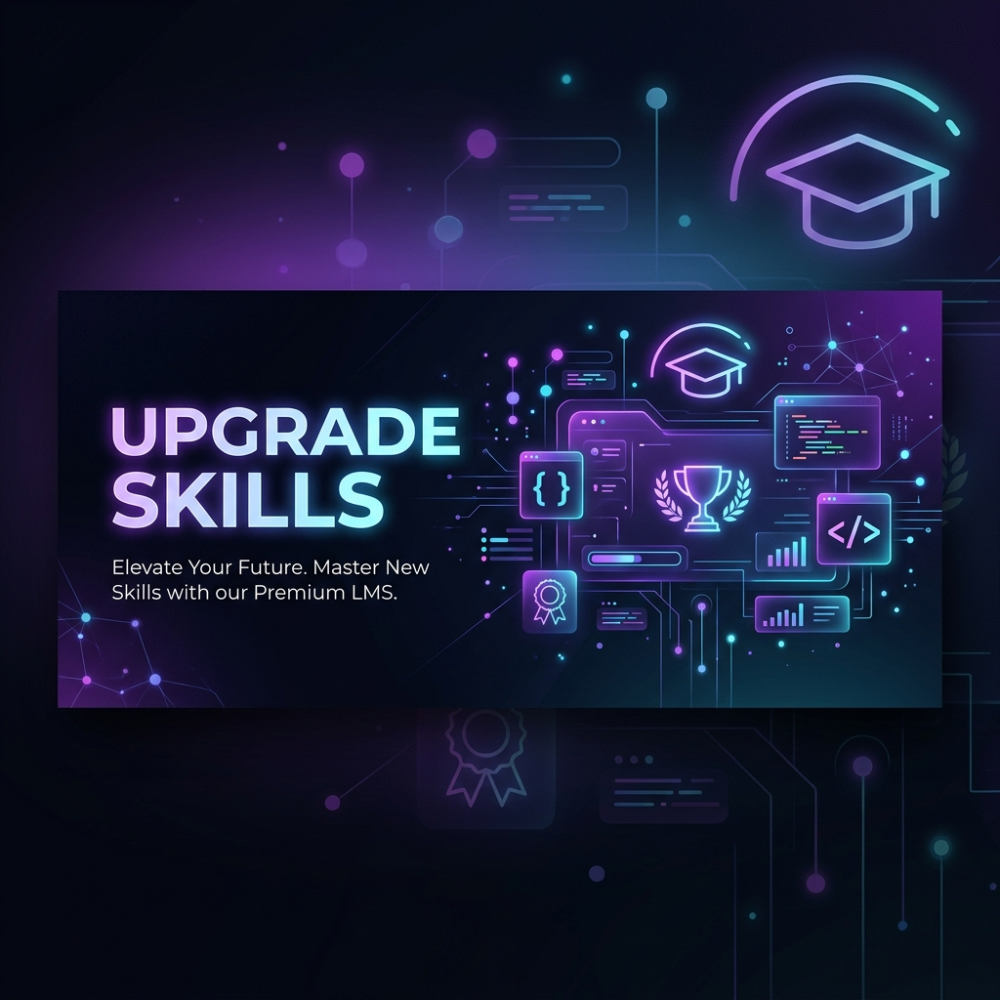
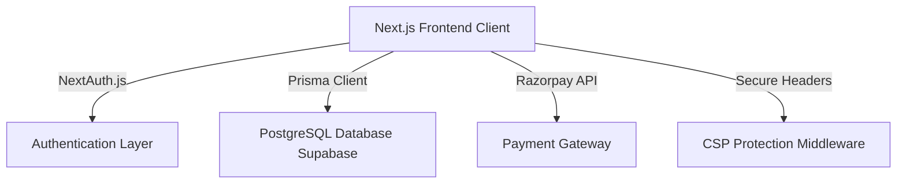

# <p align="center"></p>

<p align="center">
  
  
  
  
  
</p>

---

## 🚀 Welcome to Upgrade Skills & InnoTechXperience

**Upgrade Skills** is a premium, state-of-the-art Learning Management System (LMS) and national-level competition platform. It is designed to bridge the gap between academic learning and real-world tech portfolios by providing interactive industry courses alongside national design and hackathon challenges.

- **Learn from Experts:** Comprehensive technical courses designed and taught by global industry veterans.
- **Showcase Your Skills:** Submit your designs and web applications to national-level tech competitions.
- **Get Certified:** Earn automated PDF credentials on passing course final exams and participating in challenges.

---

## ✨ Outstanding Features

### 🎓 1. Premium Learning Experience (LMS)
* **Visual Experience:** Sleek modern interface utilizing responsive glassmorphism typography and interactive 3D background grids.
* **Curriculum Navigation:** Seamless multi-section navigation with lectures, duration details, and progression metrics.
* **Nested Discussion Forums:** In-lecture threaded Q&A workspace where students can discuss course content and receive direct responses.
* **Smart Progress Tracking:** Automatic progression saving so students can resume videos right where they left off.

### 🏆 2. InnoTechXperience (Competitions)
* **National Tech Challenges:** Engage in live design, UI/UX, and coding hackathons.
* **Project Submission Portal:** Standardized submissions including project links, visual image covers, and structured descriptions.
* **Leaderboards & Grading:** Dedicated grading capabilities to rank and review submissions.

### 💳 3. Checkout & Payment Infrastructure
* **Razorpay Gateway:** Secure checkout integration with Razorpay APIs for instant course enrolment.
* **Detailed Invoices:** Dynamic creation and downloads of billing invoices featuring billing names, addresses, and transactional information.

### 🛠️ 4. Admin & Instructor Workspaces
* **Interactive Dashboard:** Complete course editing client to build structures, arrange sections, and upload lectures.
* **Submissions Review:** Dedicated admin interface to grade challenges and issue final participation certificates.

---

## 🛠️ Architecture & Tech Stack



* **Frontend Framework:** Next.js (utilizing the App Router) with React 19.
* **Database & ORM:** PostgreSQL hosted on Supabase, mapped via Prisma Schema.
* **Authentication:** Role-Based Access Control (STUDENT, INSTRUCTOR, ADMIN) powered by `next-auth`.
* **Security Hardening:** Tight Content Security Policy (CSP) blocking XSS and clickjacking attacks.

---

## 📁 Repository Structure

```text
├── prisma/
│   ├── schema.prisma       # Database design (User, Course, Lecture, Submission, etc.)
│   └── seed.js             # Development database seed script
├── public/
│   ├── readme_banner.png   # Premium repository banner graphic
│   └── icon.png            # Application logo assets
├── src/
│   ├── app/                # Main Next.js routing pages and templates
│   ├── components/         # Reusable global design UI components
│   ├── lib/                # Database clients and helper functions
│   └── middleware.js       # Security policy & route authorization guards
├── package.json            # Dependencies and development scripts
└── next.config.mjs         # Next.js configurations
```

---

## ⚡ Getting Started

### 📋 Prerequisites
Ensure you have the following installed on your machine:
* [Node.js](https://nodejs.org/) (v18.x or later recommended)
* npm, yarn, or pnpm package manager

### 🔧 Installation

1. **Clone the Repository:**
   ```bash
   git clone https://github.com/GYANPRAKASH54/Upgrade-Skills.git
   cd Upgrade-Skills
   ```

2. **Install Dependencies:**
   ```bash
   npm install
   ```

3. **Configure Environment Variables:**
   Create a `.env` file in the root directory and set the following parameters:
   ```env
   DATABASE_URL="postgresql://<username>:<password>@<host>:<port>/postgres?pgbouncer=true"
   NEXTAUTH_URL="http://localhost:3000"
   NEXTAUTH_SECRET="your-signing-secret"
   GOOGLE_CLIENT_ID="your-google-client-id"
   GOOGLE_CLIENT_SECRET="your-google-client-secret"
   CLOUDINARY_CLOUD_NAME="your-cloudinary-name"
   CLOUDINARY_API_KEY="your-cloudinary-api-key"
   CLOUDINARY_API_SECRET="your-cloudinary-api-secret"
   RAZORPAY_KEY_ID="your-razorpay-key-id"
   RAZORPAY_KEY_SECRET="your-razorpay-key-secret"
   GEMINI_API_KEY="your-gemini-key"
   ```

4. **Initialize Database:**
   Deploy migrations and seed the initial development database:
   ```bash
   npx prisma db push
   npx prisma db seed
   ```

5. **Start Dev Server:**
   ```bash
   npm run dev
   ```
   Open [http://localhost:3000](http://localhost:3000) in your browser.

---

## 📜 Contribution Guidelines
We welcome contributions to make Upgrade Skills even better:
1. Fork the project.
2. Create your feature branch (`git checkout -b feature/AmazingFeature`).
3. Commit your changes (`git commit -m 'Add some AmazingFeature'`).
4. Push to the branch (`git push origin feature/AmazingFeature`).
5. Open a Pull Request.

---
<p align="center">Made with ❤️ for developers and creators worldwide</p>
